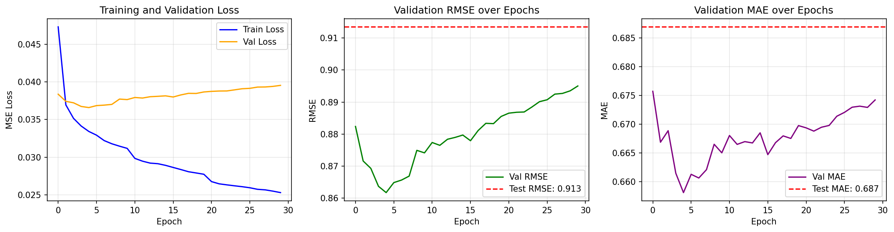
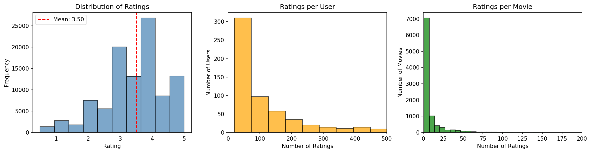
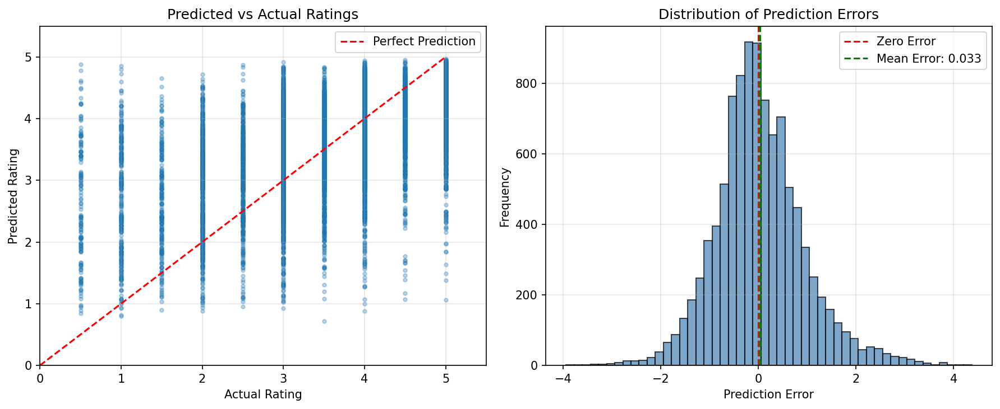

# 🎬 Neural Collaborative Filtering for MovieLens

[](https://www.python.org/downloads/)
[](https://pytorch.org/)
[](https://opensource.org/licenses/MIT)

A PyTorch implementation of **Neural Collaborative Filtering (NCF)** for movie recommendations using the MovieLens Small dataset. This project demonstrates deep learning-based recommendation systems by combining Generalized Matrix Factorization (GMF) and Multi-Layer Perceptron (MLP) approaches.



## 📊 Project Overview

This implementation adapts the NCF architecture proposed by [He et al. (2017)](https://arxiv.org/abs/1708.05031) to predict user-movie ratings. The model learns latent representations of users and movies through embedding layers and combines them via both linear (GMF) and non-linear (MLP) pathways.

### Key Results

| Metric | Value |
|--------|-------|
| **Test RMSE** | 0.9135 |
| **Test MAE** | 0.6869 |
| **Correlation** | 0.5363 |
| **Hit Rate@10** | 1.0000 |

## 🏗️ Architecture

```
┌─────────────────────────────────────────────────────────────┐
│                    NCF Architecture                         │
├─────────────────────────────────────────────────────────────┤
│                                                             │
│   User ID ──► GMF User Embedding (32-dim) ─┐               │
│                                             ├─► Element-wise │
│   Movie ID ─► GMF Movie Embedding (32-dim) ─┘    Product    │
│                                                     │       │
│   User ID ──► MLP User Embedding (32-dim) ─┐       │       │
│                                             ├─► Concat ─► MLP│
│   Movie ID ─► MLP Movie Embedding (32-dim) ─┘              │
│                                                     │       │
│                                          Concat ◄───┴───────│
│                                             │               │
│                                      Output Layer           │
│                                             │               │
│                                         Sigmoid             │
│                                             │               │
│                                      Predicted Rating       │
└─────────────────────────────────────────────────────────────┘
```

## 📁 Project Structure

```
├── NCF_MovieLens_Recommendation.ipynb  # Main Jupyter notebook
├── NCF_MovieLens_Recommendation.py     # Python script version
├── dataset/
│   ├── ratings.csv                     # User-movie ratings
│   ├── movies.csv                      # Movie metadata
│   ├── tags.csv                        # User-generated tags
│   └── links.csv                       # External database links
├── figures/
│   ├── rating_distribution.png         # Dataset visualization
│   ├── training_curves.png             # Loss/RMSE over epochs
│   ├── prediction_analysis.png         # Prediction quality analysis
│   └── *.csv                           # Exported metrics
├── requirements.txt
└── README.md
```

## 🚀 Quick Start

### Prerequisites

- Python 3.11+
- CUDA-capable GPU (optional, for faster training)

### Installation

1. **Clone the repository**
   ```bash
   git clone https://github.com/yourusername/ncf-movielens-recommendation.git
   cd ncf-movielens-recommendation
   ```

2. **Create virtual environment**
   ```bash
   python -m venv venv
   source venv/bin/activate  # On Windows: venv\Scripts\activate
   ```

3. **Install dependencies**
   ```bash
   pip install -r requirements.txt
   ```

### Running the Model

**Option 1: Jupyter Notebook**
```bash
jupyter notebook NCF_MovieLens_Recommendation.ipynb
```

**Option 2: Python Script**
```bash
python NCF_MovieLens_Recommendation.py
```

## 📈 Dataset

The [MovieLens Small Dataset](https://www.kaggle.com/datasets/shubhammehta21/movie-lens-small-latest-dataset) contains:

| Statistic | Value |
|-----------|-------|
| Users | 610 |
| Movies | 9,724 |
| Ratings | 100,836 |
| Sparsity | 98.30% |
| Rating Range | 0.5 - 5.0 |



## ⚙️ Model Configuration

| Parameter | Value |
|-----------|-------|
| Embedding Dimension | 32 |
| MLP Layers | [64, 32, 16] |
| Dropout Rate | 0.2 |
| Learning Rate | 0.001 |
| Batch Size | 256 |
| Epochs | 30 |
| Optimizer | Adam |
| Loss Function | MSE |

## 🔬 Hyperparameter Tuning

Systematic grid search was performed to identify optimal configurations:

| Embedding Dim | MLP Layers | Learning Rate | Dropout | Val RMSE |
|---------------|------------|---------------|---------|----------|
| 16 | [32,16,8] | 0.001 | 0.2 | 0.9123 |
| 32 | [64,32,16] | 0.001 | 0.2 | 0.8842 |
| 64 | [128,64,32] | 0.001 | 0.2 | 0.8901 |
| 32 | [64,32,16] | 0.001 | **0.3** | **0.8789** |

## 📊 Results Visualization

### Training Progress
The model converges within ~5 epochs, with early stopping preventing overfitting:


### Prediction Quality


## 🎯 Sample Recommendations

```
User 1:
  1. Deathgasm (2015)                              | Pred: 4.97
  2. Three Billboards Outside Ebbing, Missouri    | Pred: 4.97
  3. Hush... Hush, Sweet Charlotte (1964)         | Pred: 4.97

User 101:
  1. Three Billboards Outside Ebbing, Missouri    | Pred: 4.94
  2. Bad Boy Bubby (1993)                         | Pred: 4.93
  3. Phantom of the Paradise (1974)               | Pred: 4.93
```

## 📚 References

- He, X., Liao, L., Zhang, H., Nie, L., Hu, X., & Chua, T.-S. (2017). [Neural Collaborative Filtering](https://arxiv.org/abs/1708.05031). WWW '17.
- Harper, F. M., & Konstan, J. A. (2015). [The MovieLens Datasets: History and Context](https://doi.org/10.1145/2827872). ACM TIIS.

## 📄 License

This project is licensed under the MIT License - see the [LICENSE](LICENSE) file for details.

## 👤 Author

**John Kingsley Arthur**  
Northeastern University  
EAI 6010: Applications of Artificial Intelligence

---

⭐ If you found this project helpful, please consider giving it a star!
